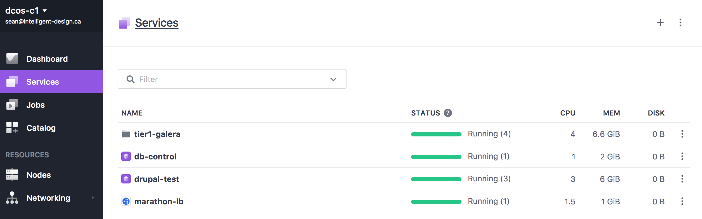
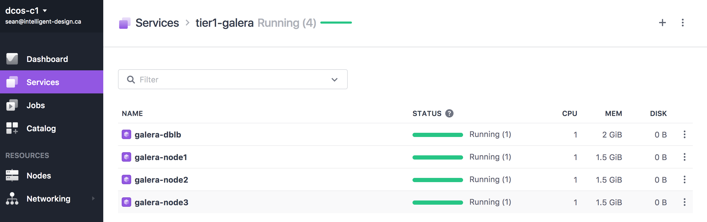
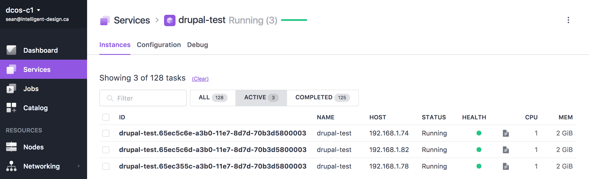

# WCEM Drupal7 and MariaDB Galera - DC/OS

The stack assumes a DC/OS cluster built with [cluster-builder](https://github.com/ids/cluster-builder).

Deployment makes use of the DC/OS cli for the most part.

#### DC/OS Application Services

#### MariaDB Galera Service Group

#### Drupal 7 Service Instances

### Deployment Steps
Starting with a freshly created cluster builder DC/OS:

#### Step 1
Run:

    ./deploy-tier1-web

This will deploy the stack in stages:

1. Create (or purge and re-create) the underlying host data volumes.
2. Deploy service group and start the Galera seed container and wait for it to startup and initialize
3. Resume remaining galera nodes and wait for them to spin up
4. Resume the HAProxy based container database load balancer

#### Step 2
Deploy the db-control instance which contains the sample data for the drupal instance:

    ./deploy-db-control

Then you have to remote into the container to install the data.

> This will become a job that is executed via metronome.

ssh into the agent node where the db-control container is running, and exec into the container. 

> Do a `docker ps`, grab the container id, and then do a `docker exec -it <container id> /bin/bash` to get into the container.  In the root folder you will find the drupaldb_snap.sql file.

    > mysql --host galera-dblb.marathon.l4lb.thisdcos.directory -u root -p < drupaldb_snap.sql

Once the data is loaded you can deploy the front end.

#### Step 3
First we need to install marathon-lb on our public agent:

    dcos marathon package install marathon-lb

Then we can deploy the Drupal7 test front end container instances

    dcos marathon app add drupal-test.json

> They will register with marathon-lb as **drupal.idstudios.local**.  You can change the host header mapping in the json file to match whatever suits your own environment.

Ensure your network can resolve the host mapping, and then point your browser at the public agent node IP where marathon-lb is running.  In the default case:

    http://drupal.idstudios.local

Will then bring up the Drupal7 front end.

> This was a quick port of the swarm solution for validation testing.  More polish is needed.